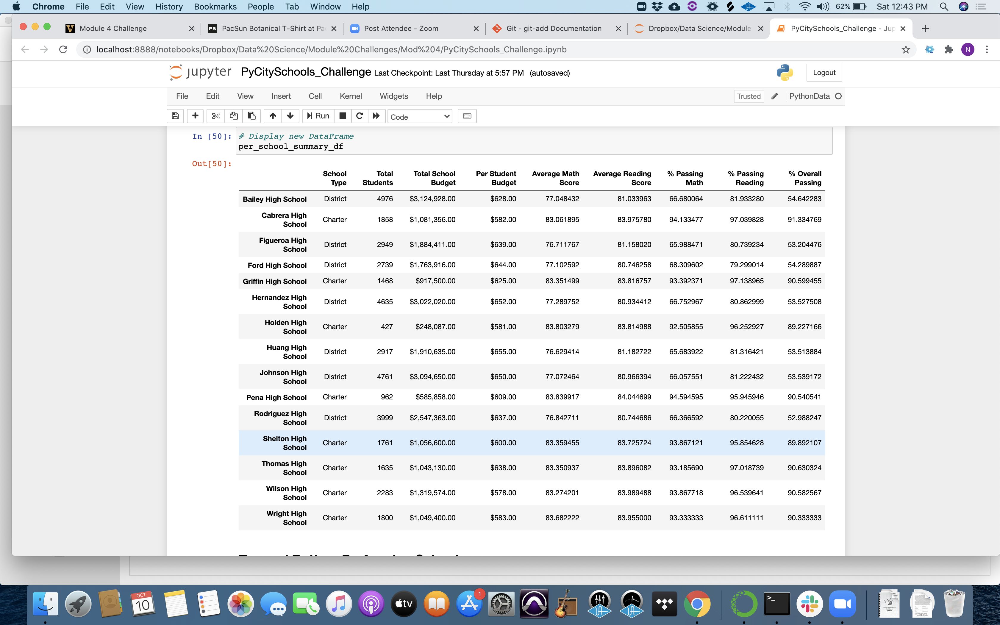
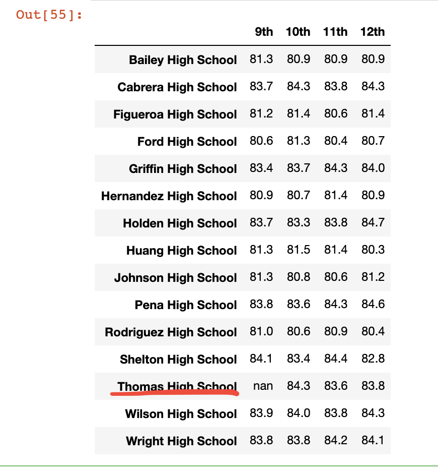

# School_Data_Analysis

## Overview of the School District Analysis:

The initial purpose of this analysis was to break down this school district by type, size, funding, etc. to look for trends in test scores and student success in the classroom.

We then proceeded to eliminate Thomas High School 9th graders to see how they were impacting the numbers we had derrived.

## Results:

- How is the district summary affected?

The overall District Summary was not drastically changed by the omission of the Thomas High School 9th Graders. The average math score did decrease by .1  and the Overall Passing Percentage decreased by .3%. However, to think that only one class in one school had that much of an impact says that we probably eliminated one of the top performers from the data set

- How is the school summary affected?

It appears that the Thomas High School 9th grade performed very well on their tests. Math it seemed was their stronger subject as their school average suffered a fraction of a percent. They also seemed to have a better Overall Passing Percentage as their school average also decreased by about .5%

- How does replacing the ninth graders’ math and reading scores affect Thomas High School’s performance relative to the other schools?

Thomas High School seems to be one of the top performing schools in the district with or without the 9th graders. Their overall effect on the data is fairly neglegable. 

- How does replacing the ninth-grade scores affect the following:
  - Math and reading scores by grade
  9th Grade for Thomas High School reads "nan"
  - Scores by school spending
  Little to no difference
  - Scores by school size
  Little to no difference
  - Scores by school type
  Little to no difference

For some reason, my District Analysis Chart will not display properly in Github so I provided an image below to show the proper result.

## Summary:

In the grand scheme, Thomas High School 9th Graders seemed to perform on par with their other classmates. That is: at a very high level.

The first change of course came in the origial DataFrame itself which altered every 9th grader's row to indicate scores of "NaN" in math and reading. Second in the overall District Analysis where we saw the scores for math tests as well as Overall Passing Percentage decrease slightly, perhaps indicating a high level of performace for the 9th graders. Third in the School Analysis where we were able to see the effects a little more dramatically in scores and percentages. And lastly, we can clearly confirm the 9th grade scores omission in the "Scores by Grade" analysis where 9th grade for Thomas High School is listed as "nan" (shown below).

